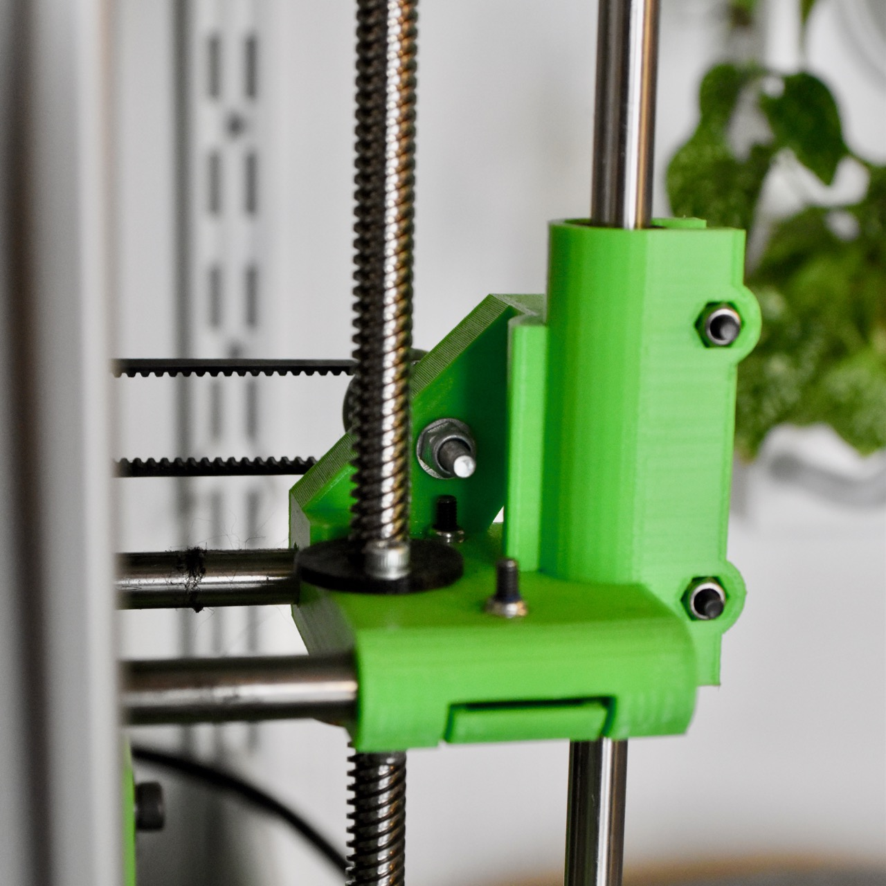

# X-ends for MendelMax 1.5 for 8mm leadscrews and 8mm rods with wobble isolator

Based on [jonaskuehling's design](http://www.thingiverse.com/thing:18384) with the following modifications:

 * 8mm trapezoidal leadscrew. See the included [image](trapezoidal_screw.png) for mechanical specifications.
 * GT2 belt, the idler thus has a hole for a M4 bolt intended for two 624 ball bearings.
 * Z wobble isolator

The design was originally made for a Prusa i2 and had flexible coupling between the X and Z axis to prevent binding issues caused buy the flexible structure of the i2 and the parallelism issues that ensued.

As this does not happen on the rigid structure of a MendelMax, this tended to exacerbate the Z wobbling issue considering that the X-ends are in that case constrained by the leadscrews and not the smooth rods. Any misalignment issues are transfered to the X-Axis and ultimately the print itself.

To prevent that, I made it so that the leadscrew nut would be able to slightly slide along the X-Axis direction and removing flexibility between the X and Z axis.

## Instructions

 * Printed in PLA at 40% infill for rigidity
 * Clean up the leadscrew holes so that the leadscrew nut slides smoothly back and forth
 * insert the top_nut part on the other side of the leadscrew nut, secure both with m3 screws

You can use the "gauge" part to get the correct spacing between the motor spindle and the smooth rod.
